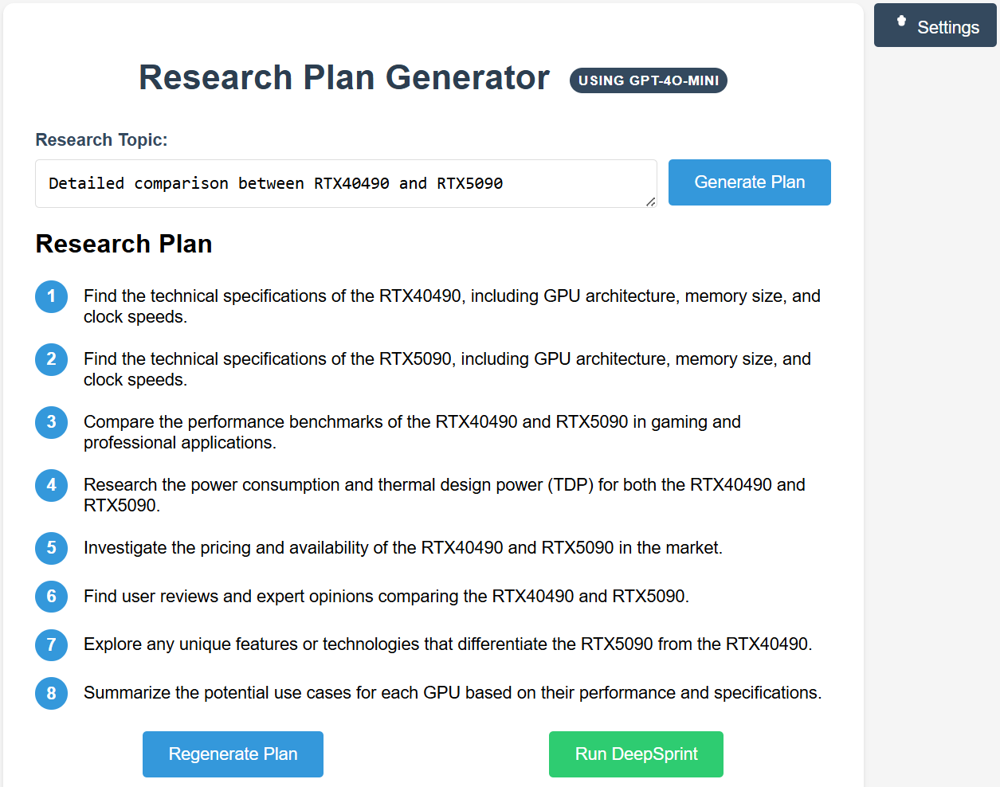
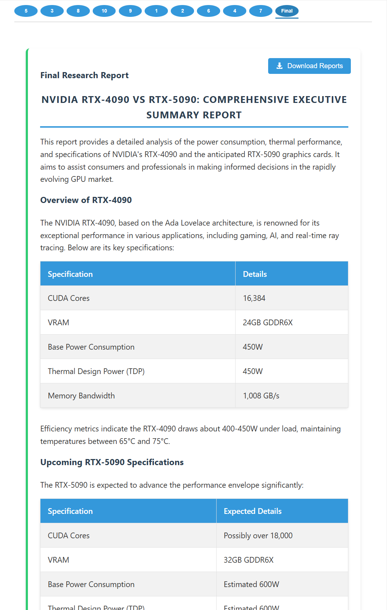
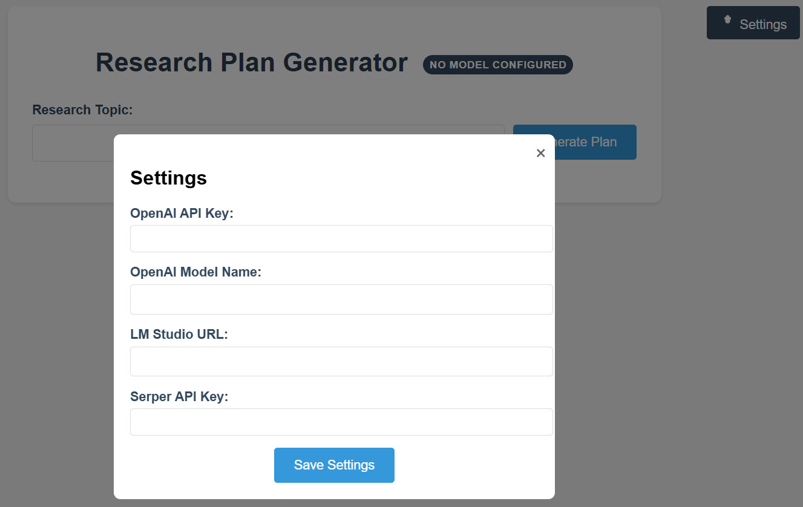
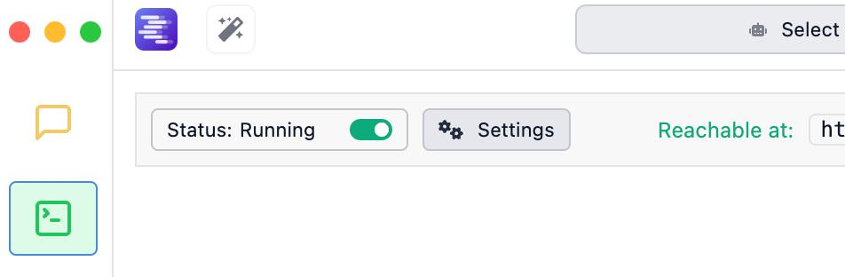
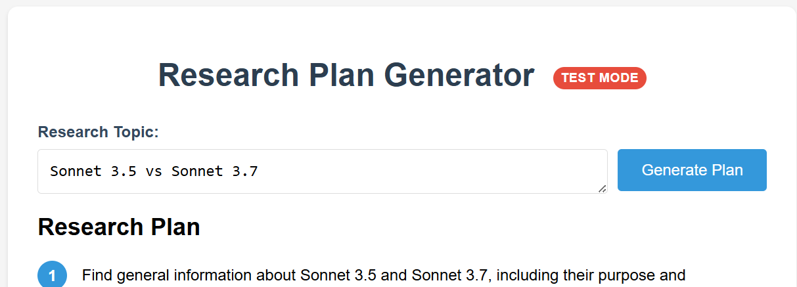

<div style="display: flex; justify-content: space-between; gap: 5px;">
    <picture>
       
    </picture>
    <picture>
       
    </picture>
</div>

# DeepSprint

DeepSprint supercharges your research with AI, helping you dive deep into any topic in record time. Born from my own need to accelerate research workflows at [Navan](https://www.navan.com), I built this tool to make thorough research accessible to everyone.

# Quick start - using OpenAI models
With pip (Python<=3.12):

```bash
git clone https://github.com/ilantwig/deepsprint.git
cd deepsprint
pip install -r requirements.txt
python app.py
```
Access the application through your web browser at `http://localhost:5000` (or the configured port)

You will need to have a Serper API key and either LM-Studio URL or OpenAI KEY and Model Name.
<picture>
    
</picture>

For permenant configuration, add your API keys for the provider you want to use to your `.env` file.

```env
OPENAI_API_KEY=
OPENAI_MODEL_NAME=
SERPER_API_KEY=
LM_STUDIO_BASE_URL="http://localhost:1234/v1"
```

# Using LM Studio models
Make sure you started LM Studio server and it's running.
<picture>
   
</picture>

## Running in test mode

```bash
python app.py --test
```
<picture>
   
</picture>

## Features

- Rapid deep research capabilities
- Support for both OpenAI and local LLM models via LM Studio
- Flexible API integration with SerperAPI for web searches
- Flask-based server architecture

## Prerequisites

- Python 3.11
- pip (Python package installer)
- LM Studio (optional, for local model usage)


### Using with OpenAI
- Make sure you have set your OpenAI API key in the `.env` file
- The application will automatically use the specified OpenAI model for processing

### Using with LM Studio
1. Start LM Studio and load your desired model
2. Copy the provided endpoint URL from LM Studio
3. Update the `LM_STUDIO_BASE_URL` in your `.env` file
4. The application will use your local model through LM Studio

## Contributing

Contributions are welcome! Please feel free to submit a Pull Request.

## License

MIT License

## Support

For issues, questions, or suggestions, please [open an issue](https://github.com/ilantwig/deepsprint/issues) on GitHub.

## Acknowledgments

- OpenAI for their powerful language models
- SerperAPI for search capabilities
- The LM Studio team for local model support

## Author

Ilan Twig, CTO and Co-founder of [Navan](https://www.navan.com)
